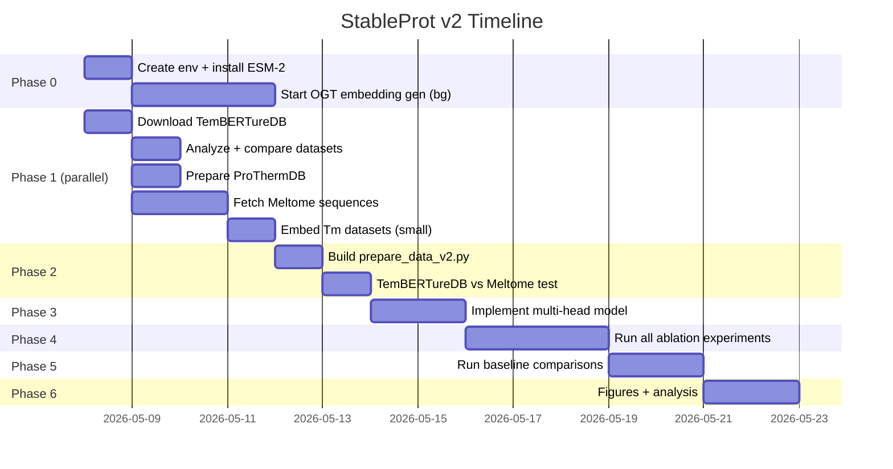

# StableProt v2 — Full Implementation Plan

## Version Progression (Updated 2026-05-13)

| Ver | Name | Embedding | Architecture | Test Set | MAE | Status |
|-----|------|-----------|-------------|----------|-----|--------|
| V0 | Original | ProtT5 | Binary ensemble (pretrained) | 210K OGT | — | ✅ |
| V1 | Baseline | ProtT5 | Binary retrained | 210K OGT | — | ✅ |
| V2 | Improved | ProtT5 | Binary improved (20 models) | 210K OGT | — | ✅ |
| V3 | Regression | ProtT5 | Single-head MSE | 210K OGT | 5.664 | ✅ |
| V4 | Improved Regr. | ProtT5 | Residual+cosine schedule+grad clip | 210K OGT | 5.724 | ✅ |
| V5 | Multi-Head | ProtT5 | Shared backbone+OGT/Tm heads | 210K OGT | 5.774 | ✅ (OGT head) |
| V6 | Multi-Head ESM2 | ESM-2 3B | Shared backbone+OGT/Tm heads | ProThermDB | 5.75 | ✅ (diff test set) |

## Architecture: Multi-Head Model (V5/V6)

```
Embedding (ProtT5 1024-dim or ESM-2 2560-dim, frozen)
        ↓
   Shared Backbone
   Linear(input, 512) → BN → ReLU → Dropout(0.3)
   Linear(512, 256)   → BN → ReLU → Dropout(0.2) + Residual
        ↓
   ┌─────────────────┬─────────────────┐
   │  Head A: OGT    │  Head B: Tm     │
   │  Linear(256, 1) │  Linear(256, 1) │
   └─────────────────┴─────────────────┘
```

- **Head A** trained on OGT data (940K sequences)
- **Head B** trained on Meltome Tm data (~24K sequences)
- **Shared backbone** learns general thermostability features from both
- **Evaluation:** Head A on 210K OGT test (compare with V0-V4), Head B for Tm prediction


---

## System Info

| Resource | Value |
|----------|-------|
| GPU | RTX 6000 Ada, 49GB VRAM |
| Disk free | 1.1 TB |
| Current env | `temstapro_env_CPU` — Python 3.7, PyTorch 1.13 (too old for ESM-2) |
| ProtT5 cache | 1,377,486 embeddings (11GB) |
| CUDA driver | 13.1 (supports PyTorch 2.x) |

**Need new env:** ESM-2 requires Python ≥3.9 and PyTorch ≥2.0.

---

## Phase 0: Environment + ESM-2 Download (Day 1) ⚡ START HERE

### 0.1 Create new conda environment

```bash
conda create -n stableprot_v2 python=3.10 -y
conda activate stableprot_v2
pip install torch torchvision --index-url https://download.pytorch.org/whl/cu118
pip install fair-esm transformers scikit-learn matplotlib openpyxl requests tqdm shap
conda install -c bioconda cd-hit -y   # For sequence deduplication
```

### 0.2 Download ESM-2 3B model weights

```python
# This downloads ~6GB of weights on first run
import esm
model, alphabet = esm.pretrained.esm2_t36_3B_UR50D()
```

Store in: `~/.cache/torch/hub/checkpoints/` (automatic)

### 0.3 Create ESM-2 embedding directory

```bash
mkdir -p /home/bibhu/Documents/temstampto/experiments/esm2_embeddings_cache
```

### 0.4 Build embedding generation script

Create `experiments/generate_esm2_embeddings.py`:
- Input: FASTA file or list of (id, sequence) tuples
- Output: Per-protein `.pt` files in `esm2_embeddings_cache/`
- Format: `esm2_{sha256(seq)}.pt` → tensor of shape (2560,)
- Mean-pool last hidden layer across residues
- Batch by similar length for GPU efficiency
- Skip already-cached sequences (resumable)
- Chunk processing (10K per chunk, same pattern as ProtT5 script)

### 0.5 Start OGT embedding generation (runs in background ~2-3 days)

```bash
# Priority 1: Start the big job immediately
nohup python generate_esm2_embeddings.py \
  --fasta ../dataset/TemStaPro-Major-30-imbal-training.fasta \
  --cache-dir esm2_embeddings_cache/ \
  --max-seq-len 1500 \
  > esm2_train_embed.log 2>&1 &

# Then validation + test
nohup python generate_esm2_embeddings.py \
  --fasta ../dataset/TemStaPro-Major-30-imbal-validation.fasta \
  --cache-dir esm2_embeddings_cache/ \
  > esm2_val_embed.log 2>&1 &
```

**Estimated time:** ~40-50 hours for 1.4M sequences at ~8 seq/s on ESM-2 3B.

> [!IMPORTANT]
> Start this FIRST. Everything else can happen in parallel while embeddings generate.

---

## Phase 1: Data Acquisition (Days 1-3, parallel with Phase 0)

### 1.1 Download TemBERTureDB

```bash
cd /home/bibhu/Documents/temstampto
git clone https://github.com/ibmm-unibe-ch/TemBERTure.git TemBERTure_repo
cd TemBERTure_repo/data
tar -xzf TemBERTure_reg.tar.gz
tar -xzf TemBERTure_cls.tar.gz
tar -xzf Meltome_cls.tar.gz
```

### 1.2 Analyze TemBERTureDB regression data

Script: `experiments/analyze_tembert_data.py`
- Parse `TemBERTureTrain_reg.txt`, `Val`, `Test` — identify columns, count sequences
- Plot Tm distribution histogram
- Extract unique UniProt IDs
- Check: do they include FASTA sequences or just IDs?

### 1.3 Analyze our Meltome data

Script: `experiments/analyze_meltome_data.py`
- Parse `new_data/meltome-atlas/cross-species.csv`
- Extract unique (Protein_ID, median meltPoint) per protein
- Fetch FASTA sequences from UniProt REST API (batch of 500)
- Save as `new_data/meltome_sequences.fasta`
- Plot Tm distribution, compare with TemBERTureDB

### 1.4 Prepare ProThermDB validation set

Script: `experiments/prepare_prothermdb.py`
- Parse all 6 xlsx files in `new_data/prothermadb/`
- Filter: MUTATION == 'wild' AND Tm_(C) is not null
- Deduplicate by UniProt ID (take median Tm if multiple measurements)
- Fetch FASTA sequences from UniProt REST API
- Save as `new_data/prothermdb_validation.fasta` + `prothermdb_validation.csv`
- **Check overlap** with TemBERTureDB training set → remove overlapping proteins

### 1.5 Overlap analysis + Cross-Dataset CD-HIT Deduplication

Script: `experiments/check_overlaps.py`
- TemBERTureDB train ∩ ProThermDB → must be zero
- TemBERTureDB train ∩ Meltome → expected high overlap
- OGT dataset ∩ ProThermDB → document for paper
- Report counts and save clean, non-overlapping splits

**CD-HIT at 40% across OGT ↔ Tm datasets** (prevents data leakage):
- Combine all OGT training sequences + all ProThermDB test sequences + Tm validation sequences into one FASTA
- Run CD-HIT at 40% identity
- Remove any **OGT training** sequence that clusters with a ProThermDB test OR Tm validation sequence
- **Do NOT remove ProThermDB/Tm entries** — test and validation sets are ground truth, must stay intact
- This prevents: (a) test leakage, (b) early stopping leakage via Tm validation
- **Non-negotiable for publication** — reviewers will ask about train/test leakage
- **Post-removal check:** Plot OGT histograms of (a) original training set, (b) removed sequences, (c) final training set. If removed sequences are skewed toward thermophiles, document it in the paper.

### 1.6 Generate ESM-2 embeddings for Tm datasets

```bash
# These are small, ~1-2 hours each
python generate_esm2_embeddings.py --fasta new_data/meltome_sequences.fasta
python generate_esm2_embeddings.py --fasta new_data/prothermdb_validation.fasta
# TemBERTureDB sequences (after extracting from their format)
python generate_esm2_embeddings.py --fasta new_data/tembert_reg_sequences.fasta
# TemBERTure test split (for Phase 5.4 direct comparison)
python generate_esm2_embeddings.py --fasta new_data/tembert_test_sequences.fasta
```

### 1.7 Add OGT labels to Tm datasets (for Experiment F)

Script: `experiments/add_ogt_to_tm_datasets.py`
- Map organism names in Meltome/ProThermDB → OGT values using the OGT training dataset as reference
- Meltome has organism names (e.g., *E. coli* → 37°C, *T. thermophilus* → 72°C)
- ProThermDB has organism names in the SOURCE_ORGANISM column
- Output: `new_data/meltome_with_ogt.csv`, `new_data/prothermdb_with_ogt.csv`
- Proteins without a matching OGT → mark as NaN (exclude from Experiment F only)

---

## Phase 2: Prepare Combined Dataset (Days 3-5)

### 2.1 Build unified data preparation script

Create `experiments/prepare_data_v2.py`:
- Loads ESM-2 embeddings (2560-dim) from `esm2_embeddings_cache/`
- Assembles three datasets:

| Dataset | Source | Labels | Size | Purpose |
|---------|--------|--------|------|---------|
| OGT train/val/test | TemStaPro FASTA | OGT (4-100°C) | ~1.4M | Head A training |
| Tm train/val | TemBERTureDB reg OR Meltome | Tm (27-99°C) | ~25K | Head B training |
| Tm test | ProThermDB | Tm (0-100°C) | ~3.5K | Final validation |

- Saves as `prepared_data_esm2_v2.pt`:
```python
{
    'ogt_train_embeddings': tensor,  # (N, 2560)
    'ogt_train_temps': list,
    'ogt_val_embeddings': tensor,
    'ogt_val_temps': list,
    'tm_train_embeddings': tensor,   # (~20K, 2560)
    'tm_train_temps': list,
    'tm_val_embeddings': tensor,     # (~5K, 2560)
    'tm_val_temps': list,
    'prothermdb_embeddings': tensor, # (~3.5K, 2560)
    'prothermdb_temps': list,
}
```

### 2.2 Compare TemBERTureDB vs Meltome

Train a simple regression (Head B only) on each, evaluate on ProThermDB:
- `tm_source=tembert` → TemBERTureDB regression split
- `tm_source=meltome` → Our Meltome extraction

Pick whichever gives lower ProThermDB MAE. Document both results.

---

## Phase 3: Multi-Head Model Implementation (Days 5-7)

### 3.1 Create new experiment directory

```
experiments/v4_multihead/
├── __init__.py
├── config.py
├── model.py          # MultiHead_TmPredictor
├── train.py          # Multi-head training loop
├── evaluate.py       # Evaluate on ProThermDB + binary thresholds
└── results/
```

### 3.2 Model (`model.py`)

```python
class MultiHead_TmPredictor(nn.Module):
    def __init__(self, input_size=2560, hidden1=512, hidden2=256,
                 dropout1=0.3, dropout2=0.2):
        # Shared backbone
        self.backbone = nn.Sequential(
            nn.Linear(input_size, hidden1),
            nn.BatchNorm1d(hidden1),
            nn.ReLU(),
            nn.Dropout(dropout1),
            nn.Linear(hidden1, hidden2),
            nn.BatchNorm1d(hidden2),
            nn.ReLU(),
            nn.Dropout(dropout2),
        )
        # Two prediction heads
        self.head_ogt = nn.Linear(hidden2, 1)  # Head A: OGT
        self.head_tm = nn.Linear(hidden2, 1)   # Head B: Tm

    def forward(self, x, head='tm'):
        features = self.backbone(x)
        if head == 'ogt':
            return self.head_ogt(features).squeeze(-1)
        else:
            return self.head_tm(features).squeeze(-1)
```

### 3.3 Training loop (`train.py`)

Each epoch:
1. Iterate OGT batches → forward through backbone + Head A → Weighted Huber loss
2. Iterate Tm batches → forward through backbone + Head B → Weighted Huber loss
3. Backprop both losses through shared backbone
4. Validate on Tm validation set using Head B
5. Early stopping on Tm validation MAE

**Training procedure:** Single optimizer (Adam). Gradients zeroed after each batch independently. OGT and Tm batches are **never mixed** in the same forward pass — prevents gradient conflict between heads.

### 3.4 Regression Improvements Checklist (ALL must be in v4_multihead)

- [ ] **Target normalization** — z-score: `t_norm = (t - mean) / std`. Store mean/std from training set. Denormalize predictions at inference.
- [ ] **Weighted Huber loss** — replace MSE with `nn.HuberLoss(delta=5.0)`. Robust to noisy OGT labels.
- [ ] **Per-sample weights** — inverse bin frequency. Bins: `[0,20), [20,30), [30,40), [40,50), [50,60), [60,70), [70,80), [80,100]`. `weight_i = total / (n_bins * count_in_bin_i)`
- [ ] **LR scheduler** — `ReduceLROnPlateau(optimizer, patience=5, factor=0.5, min_lr=1e-6)` based on val MAE
- [ ] **Gradient clipping** — `torch.nn.utils.clip_grad_norm_(model.parameters(), max_norm=1.0)` every step
- [ ] **Residual connection** — skip connection around second hidden layer: `out = layer2(x) + project(x)` (project if dims differ)
- [ ] **Mixup augmentation** — interpolate (embedding, label) pairs: `x_mix = λ*x_i + (1-λ)*x_j`, `y_mix = λ*y_i + (1-λ)*y_j`, λ ~ Beta(0.2, 0.2)
- [ ] **Ensemble uncertainty** — report `mean ± std` across 5 seeds per prediction

### 3.8 Attention Pooling Comparison (Tm dataset only)

Instead of mean-pooling ESM-2 per-residue embeddings, implement a learned attention module:
```python
class AttentionPool(nn.Module):
    def __init__(self, dim=2560):
        self.attn = nn.Linear(dim, 1)
    def forward(self, x):  # x: (batch, seq_len, 2560)
        weights = F.softmax(self.attn(x), dim=1)  # (batch, seq_len, 1)
        return (x * weights).sum(dim=1)  # (batch, 2560)
```
- **Only for Tm dataset (~25K)** — per-residue embeddings for 1.4M OGT proteins = ~2TB, not feasible
- **Storage:** 25K proteins × ~400 residues × 2560 dims × 4 bytes ≈ **~100GB**. Feasible (1.1TB free) but large.
- **Alternative:** Compute attention pooling on-the-fly by loading ESM-2 during training (49GB VRAM handles ESM-2 3B + MLP). Slower but no extra disk.
- **For fair comparison:** Both Experiment D (mean pool) and attention variant use per-residue embeddings — only the pooling method differs.
- Compare mean pool vs attention pool on Tm-only experiment (D)
- If attention wins → use for Head B, keep mean pool for Head A
- Attention weights provide **per-residue interpretability** (which positions matter for Tm)

### 3.9 SHAP Explainer Wrapper

After final model is trained:
- Run SHAP on the **256-dim hidden layer** (not raw 2560-dim ESM-2 embeddings — too many dims for readable plots)
- Use `shap.DeepExplainer` on the Tm head: input = backbone output (256-dim)
- Generate SHAP summary plot (beeswarm) for Phase 6 figures
- Low effort: `pip install shap`, ~50 lines of code

### 3.5 ESM-2 Layer Selection Experiment

ESMStabP found layer 33 of ESM-2 650M (33 layers total) is optimal. ESM-2 3B has 36 layers.

- `esm2_t36_3B_UR50D` uses `repr_layers` 0 (input) through 36 (final). Test layers **30, 33, 36**.
- Train quick single-seed regression on each with 1K subset → pick best layer
- **Do this BEFORE starting full OGT embedding generation** (Phase 0.5) to avoid regenerating 1.4M embeddings

### 3.6 Config (`config.py`)

```python
CONFIG = {
    'input_size': 2560,           # ESM-2 3B
    'hidden_size_1': 512,
    'hidden_size_2': 256,
    'dropout_1': 0.3,
    'dropout_2': 0.2,
    'learning_rate': 1e-4,
    'batch_size': 64,
    'num_epochs': 50,
    'early_stopping_patience': 10,
    'weight_decay': 1e-5,
    'loss_type': 'huber',
    'huber_delta': 5.0,
    'ogt_loss_weight': 0.3,       # OGT head loss weight
    'tm_loss_weight': 1.0,        # Tm head loss weight
    'lr_scheduler_patience': 5,
    'lr_scheduler_factor': 0.5,
    'grad_clip_max_norm': 1.0,
    'mixup_alpha': 0.2,
    'target_normalization': True,
    'seeds': [1, 2, 3, 4, 5],
}
```

### 3.7 Evaluation Metrics

For regression:
- **MAE** (Mean Absolute Error) — primary
- **RMSE** (Root Mean Squared Error)
- **R²** (Coefficient of determination)
- **PCC** (Pearson Correlation Coefficient)
- **MAE by temperature bin** (8 bins as above)

For comparison with binary classifiers (TemStaPro):
- Convert Tm predictions to binary labels at each threshold
- Compute AUC-ROC, F1, MCC at thresholds 0, 5, 10, ..., 100°C

---

## Phase 4: Training Experiments (Days 7-10)

### 4.1 Ablation experiments (run all, compare)

| Experiment | Embedding | Architecture | Training Data | Loss |
|---|---|---|---|---|
| A. Baseline (current V3) | ProtT5 (1024) | Single-head MLP | OGT only | MSE |
| B. ESM-2 single-head OGT | ESM-2 (2560) | Single-head MLP | OGT only | MSE |
| C. ESM-2 + Huber + OGT | ESM-2 (2560) | Single-head MLP | OGT only | Weighted Huber |
| D. ESM-2 + Tm direct | ESM-2 (2560) | Single-head MLP | Tm only (25K) | Weighted Huber |
| E. ESM-2 + Multi-head | ESM-2 (2560) | **Multi-head** | OGT + Tm | Weighted Huber |
| F. ESM-2 + OGT-as-feature | ESM-2 (2560) + OGT (1) | Single-head MLP (input=2561) | Tm only (25K) | Weighted Huber |

Experiment F mirrors ESMStabP's approach (OGT as input feature, not label). If E beats F, it proves multi-head > feature concatenation — directly addresses a likely reviewer question.

**Experiment F data requirement:** Each Tm protein needs its organism's OGT. Map organism names from Meltome/ProThermDB → OGT using BacDive or the OGT dataset. Add this mapping step to Phase 1.3/1.4.

Each experiment: 5 seeds, ensemble prediction. Evaluate on ProThermDB.

### 4.2 Additional comparison: TemBERTureDB vs Meltome

Run experiment D and E with both data sources. Pick better one.

### 4.3 OGT Loss Weight Sweep

The `ogt_loss_weight` (λ=0.3) is a critical hyperparameter. Quick grid search:
- Test λ ∈ {0.01, 0.05, 0.1, 0.3, 0.5, 1.0}
- Use 1K Tm validation subset, single seed, 10 epochs
- Pick λ that minimizes Tm validation MAE → use for full training

### 4.3 K-Fold Cross-Validation on Tm Data

Since Tm dataset is small (~25K), single train/val split is unreliable:
- 5-fold CV on the Tm data for the best model (experiment E)
- Report mean ± std MAE across folds
- This gives reviewers confidence the result isn't split-dependent

---

## Phase 5: Baseline Comparisons (Days 10-12)

### 5.1 Run TemStaPro (V0) on ProThermDB

Already in our codebase. Convert ProThermDB Tm to binary at thresholds 40-65°C, run existing V0 evaluation.

### 5.2 Clone and run TemBERTureTm

```bash
cd /home/bibhu/Documents/temstampto
# Already cloned in Phase 1
cd TemBERTure_repo
pip install -r requirements.txt  # in stableprot_v2 env
# Run 3 replicas on ProThermDB sequences
python -c "from temBERTure import TemBERTure; ..."
```

### 5.3 Clone and run ESMStabP

```bash
git clone <ESMStabP_repo>
# Run on ProThermDB sequences
```

### 5.4 Run our model on TemBERTure's own test split

Critical for direct comparison with their published numbers:
- Load `TemBERTureTest_reg.txt`
- Generate ESM-2 embeddings for those sequences
- Run our ensemble prediction → compare MAE/R²/PCC with their reported results

### 5.5 Comparison table

| Method | Embedding | ProThermDB MAE | TemBERTure Test MAE | R² | PCC |
| TemStaPro | ProtT5 | (OGT, convert) | — | — |
| TemBERTureTm | protBERT-BFD | X | X | X |
| ESMStabP | ESM-2 650M | X | X | X |
| **Ours** | **ESM-2 3B** | **X** | **X** | **X** |

---

## Phase 6: Figures & Analysis (Days 12-14)

### 6.1 Core Figures
1. Scatter plot: Predicted Tm vs Experimental Tm (ProThermDB), colored by organism type
2. Bar chart: MAE comparison across all methods
3. Heatmap: MAE by temperature bin × method
4. Ablation table (experiments A→E)
5. Training data Tm distribution histograms (OGT vs Meltome vs TemBERTureDB)

### 6.2 Stratified Error Analysis
- **By Tm bin:** <40°C, 40–60°C, 60–80°C, >80°C
- **By sequence length:** <300 aa, 300–800 aa, >800 aa
- **By organism type:** Bacteria vs Archaea vs Eukaryota
- **Per-species MAE** for all species in ProThermDB

### 6.3 Interpretability Figures
- Attention maps (if attention pooling adopted): compare thermophilic vs mesophilic homologue
- SHAP summary plot: top 20 ESM-2 dimensions driving Tm predictions

### 6.4 Uncertainty & Calibration
- Uncertainty plot: prediction ± ensemble std for a range of proteins
- **Calibration curve:** binned predicted std vs actual MAE (well-calibrated = diagonal)

### 6.5 Statistical Tests
- Wilcoxon signed-rank test: our predictions vs each baseline on ProThermDB
- Bootstrap 95% confidence intervals for MAE
- Paired t-test across K-fold splits

---

## Next Steps (Post-MVP)

- [ ] **LoRA fine-tuning of ESM-2** — add lightweight adapters to last 3 layers, train on Tm data. Novel contribution but high overfitting risk with 25K samples. Requires loading full ESM-2 during training.
- [ ] Cosine annealing with warmup LR schedule
- [ ] Deeper/wider architectures
- [ ] CD-HIT clustering analysis at 30/50/70% thresholds
- [ ] Structure-aware embeddings (SaProt) comparison
- [ ] ΔΔG mutation prediction using FireProtDB
- [ ] Web server deployment

---

## File Structure (New)

```
temstampto/
├── experiments/
│   ├── esm2_embeddings_cache/          # NEW: ESM-2 3B embeddings
│   ├── generate_esm2_embeddings.py     # NEW: ESM-2 embedding script
│   ├── analyze_tembert_data.py         # NEW: TemBERTureDB analysis
│   ├── analyze_meltome_data.py         # NEW: Meltome analysis
│   ├── prepare_prothermdb.py           # NEW: ProThermDB preparation
│   ├── check_overlaps.py              # NEW: Dataset overlap analysis
│   ├── prepare_data_v2.py             # NEW: Combined data builder
│   ├── v4_multihead/                   # NEW: Multi-head model
│   │   ├── config.py
│   │   ├── model.py
│   │   ├── train.py
│   │   ├── evaluate.py
│   │   └── results/
│   ├── v0_original/                    # Keep for comparison
│   ├── v3_regression/                  # Keep for ablation baseline
│   └── prepared_data_esm2_v2.pt       # NEW: ESM-2 based dataset
├── TemBERTure_repo/                    # NEW: Cloned TemBERTure
├── new_data/                           # Existing experimental databases
└── dataset/                            # Existing OGT FASTA files
```

---

## Execution Order (Critical Path)


