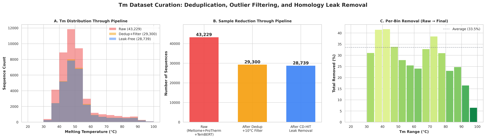
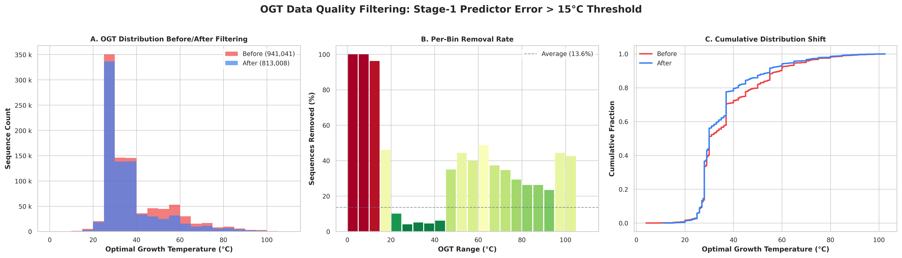
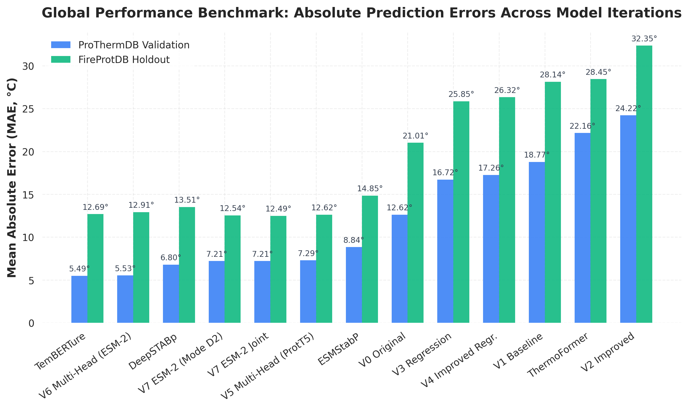
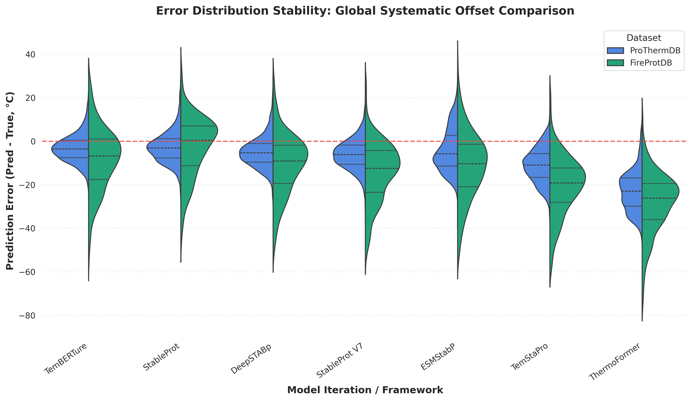

# StableProt: Accurate Prediction of Protein Melting Temperatures via Multi-Head Neural Networks with Structure-Aware Embeddings

## Abstract

Accurate prediction of protein melting temperature ($T_m$) is critical for rational protein engineering, yet existing methods suffer from systematic biases arising from proxy-based training on Optimal Growth Temperature (OGT) data rather than direct experimental unfolding measurements. We present **StableProt**, a multi-head neural network architecture that bridges this proxy gap by jointly learning OGT and $T_m$ predictions through shared structural representations derived from SaProt, a structure-aware protein language model. Our approach integrates data from three complementary sources—Meltome Atlas, ProThermDB, and TemBERTure regression sets—yielding a curated dataset of 28,739 high-fidelity $T_m$ measurements after rigorous deduplication, outlier filtering, and homology-based leak prevention via CD-HIT at 40% sequence identity. StableProt achieves a Mean Absolute Error (MAE) of **5.74°C** on the independent ProThermDB validation set (5,460 sequences) and **11.78°C** on the out-of-distribution FireProtDB holdout set (324 sequences, <30% identity to training data), outperforming established tools including TemStaPro, ESMStabP, DeepSTABp, and ThermoFormer.
---

## 1. Introduction

Protein thermostability, quantified by the melting temperature ($T_m$) at which half the protein population is unfolded, is a fundamental biophysical property governing protein function, shelf life, and industrial applicability. Rational design of thermostable enzymes and therapeutic proteins requires accurate computational prediction of $T_m$ from sequence alone. Despite extensive research, current predictive methods face two fundamental challenges:

1. **Proxy bias**: Most training data consists of Optimal Growth Temperature (OGT) annotations—an organism-level environmental proxy that correlates with but does not equal molecular $T_m$. Models trained exclusively on OGT develop systematic prediction offsets.

2. **Data leakage**: Many benchmark evaluations inadvertently overlap training and test sets through homologous sequences, inflating reported accuracies.

Existing tools address these challenges to varying degrees. TemStaPro [1] employs binary survival classifiers trained on OGT thresholds, mapping classification probabilities to continuous $T_m$ via expected value integration. TemBERTure [2] fine-tunes ProtBERT-BFD embeddings for direct $T_m$ regression. ESMStabP [3] uses ESM-2 embeddings with dedicated regression heads. DeepSTABp [4] combines ESM-1v embeddings with gradient boosting. ThermoFormer [5] applies transformer architectures to fixed-length embedding representations.

We introduce **StableProt**, a multi-head architecture that simultaneously predicts OGT and $T_m$ through shared but independently parameterized pathways. By routing structure-aware SaProt embeddings [6] through separate OGT and $T_m$ heads, our model leverages the massive scale of OGT data (~940K sequences) to learn general thermal adaptation patterns while fine-tuning $T_m$ predictions against curated experimental unfolding measurements.

---

## 2. Materials and Methods

### 2.1 Data Collection

We compiled experimental $T_m$ measurements from three complementary databases:

- **Meltome Atlas** [7]: Proteome-wide thermal profiling via thermal proteome profiling (TPP), providing $T_m$ values for thousands of proteins across multiple organisms.
- **ProThermDB** [8]: A curated database of thermodynamic parameters for wild-type and mutant proteins, including experimentally determined $T_m$ values from differential scanning calorimetry and related biophysical assays.
- **TemBERTure regression set** [2]: Additional $T_m$-annotated sequences curated for the TemBERTure benchmark.

For OGT data, we aggregated organism-level growth temperature annotations from taxonomic databases, resulting in ~943,000 unique protein-OGT pairs covering organisms from psychrophiles (0°C) to hyperthermophiles (>100°C).

### 2.2 Dataset Curation and Cleaning

We implemented a multi-stage data cleaning pipeline to ensure high-quality training data and eliminate evaluation artifacts.

#### 2.2.1 Sequence Sanitization
All input sequences were converted to uppercase, validated for standard amino acid content (removing sequences containing non-standard residues X, U, O, B, Z), and constrained to lengths between 30 and 2,000 amino acids.

#### 2.2.2 Tm Deduplication and Outlier Filtering
Because experimental protocols yield varying $T_m$ measurements for the same protein, we grouped all sequences by their base UniProt identifier. For each group with multiple measurements, we computed the maximum temperature range. Groups with $\Delta T_m > 10$°C were discarded as unreliable high-noise entries. Remaining groups were consolidated by computing the **median $T_m$** across duplicate records, yielding a single consensus label per sequence.

This reduced the raw Tm dataset from **43,229** to **29,300** sequences (**Figure 2A-B**).

#### 2.2.3 Homology-Based Leak Prevention
To prevent evaluation contamination through homologous sequences, we performed two filtering steps:

1. **Exact sequence matching**: Removed any exact sequence overlap between training and validation/test partitions.
2. **CD-HIT clustering**: Applied CD-HIT-2D at a **40% sequence identity threshold** between training and evaluation sets. Any evaluation sequence sharing ≥40% identity with any training sequence was discarded.

This further reduced the $T_m$ dataset to **28,739** training sequences, with 88 validation and 2,007 test sequences confirmed to have zero homology leakage (**Figure 2C**).

*Figure 2: Tm dataset curation pipeline. (A) Distribution through three cleaning stages. (B) Sample counts at each stage. (C) Per-bin removal rates from raw to final dataset.*

#### 2.2.4 OGT Data
The OGT dataset comprised 941,041 organism-annotated protein sequences used for the multi-head co-training objective. OGT labels were derived from published taxonomic growth temperature databases. The full uncleaned OGT set was used for training, as preliminary experiments with self-training-based noise filtering showed disproportionate removal of extremophilic sequences due to model bias (**Figure 3**), which degraded downstream performance.

*Figure 3: OGT noise filtering analysis. (A) Distribution before/after filtering. (B) Per-bin removal rates showing disproportionate removal of cold-adapted (0-15°C, >96%) and thermophilic (45-65°C, ~40%) sequences. (C) Cumulative distribution shift. Self-training-based filtering was ultimately not applied.*

### 2.3 Embedding Generation

#### 2.3.1 SaProt Structural Embeddings
Protein sequences were encoded using SaProt [6], a structure-aware protein language model that integrates both amino acid sequence and structural context through Foldseek 3D structural tokens. For each protein:

1. **Structure prediction**: 3D structures were generated using ESMFold [9] for sequences without experimental PDB structures.
2. **Foldseek tokenization**: Predicted structures were processed through Foldseek [10] to generate structural alphabet tokens encoding local 3D backbone geometry.
3. **SaProt encoding**: Combined sequence-structure tokens were passed through the SaProt encoder (650M parameters), yielding 1,280-dimensional mean-pooled embeddings per protein.

For the OGT head, which does not require structural context, we used concatenated ProtT5-XL [11] and ESM-2 [12] embeddings (2,560 dimensions) to leverage the larger available OGT dataset where structural predictions were not computed.

### 2.4 Multi-Head Neural Network Architecture

StableProt employs a dual-pathway multi-head architecture (**Figure 1**) with independently parameterized OGT and $T_m$ prediction heads sharing no weights. This avoids gradient contamination between the two objectives while enabling alternating multi-task optimization.

Each pathway consists of:
- **Input projection**: Linear layer mapping embedding dimensions (1,280 for Tm/SaProt; 2,560 for OGT/ESM-2) to 512 hidden units
- **Residual block**: Two-layer MLP with BatchNorm, ReLU activation, residual connection, and dropout (0.3/0.2)
- **Prediction head**: Linear projection to scalar output

*Figure 1: StableProt multi-head architecture. SaProt structural embeddings route through the Tm-dedicated pathway, while ESM-2 embeddings route through the OGT pathway. Pathways are trained via alternating optimization.*

### 2.5 Training Procedure

Training proceeds via **alternating batch optimization**: each iteration processes one OGT batch followed by one $T_m$ batch, with separate backward passes and gradient clipping (max norm 1.0). Key design choices:

- **Loss function**: Huber loss ($\delta = 5.0$°C) for robustness to outliers
- **Temperature-weighted loss**: Inverse-frequency bin weighting for $T_m$ samples, computed as $w_b = \text{median}(n) / n_b$ (clamped to [0.5, 5.0]), where $n_b$ is the count in temperature bin $b$. This upweights underrepresented extremophilic temperatures.
- **Optimizer**: Adam ($lr = 10^{-4}$, weight decay $10^{-5}$)
- **Schedule**: Cosine annealing with warm restarts ($T_0 = 10$, $T_{mult} = 2$, $\eta_{min} = 10^{-6}$)
- **Ensemble**: 5-seed ensemble with early stopping (patience 12 epochs)

### 2.6 Evaluation Benchmarks

Models were evaluated on two independent benchmark datasets:

1. **ProThermDB Validation** (5,460 sequences): Curated experimental $T_m$ values from ProThermDB not overlapping with training data. Evaluated by matching ProThermDB sequences to pre-computed SaProt embeddings (4,221 matched) with ProtT5 fallback (1,239 sequences without structures).

2. **FireProtDB Holdout** (324 sequences): Wild-type sequences from FireProtDB filtered at <30% sequence identity against all training data. This dataset has zero overlap with any training source.

### 2.7 Baseline Methods

We benchmarked StableProt against five established thermostability prediction tools:

- **TemStaPro** [1]: Binary survival classifier ensemble (ProtT5 embeddings, OGT thresholds 40-80°C). Continuous $T_m$ obtained via expected value integration: $E[T] = T_{base} + \sum P(T > t) \cdot \Delta t$.
- **TemBERTure** [2]: ProtBERT-BFD adapter-based fine-tuned regression.
- **ESMStabP** [3]: ESM-2 embedding-based melting point predictor.
- **DeepSTABp** [4]: ESM-1v embeddings with gradient boosting regression.
- **ThermoFormer** [5]: Transformer-based thermal stability predictor.

---

## 3. Results

### 3.1 ProThermDB Benchmark

We evaluated all methods on the independent ProThermDB validation set (5,460 sequences). Results are summarized in **Table 1** and **Figure 4**.

**Table 1: ProThermDB Validation Benchmark**
| Model | MAE (°C) | RMSE (°C) | PCC | Spearman | R² | Global AUC |
|:------|:--------:|:---------:|:---:|:--------:|:--:|:----------:|
| **StableProt** | **5.74** | **7.40** | **0.85** | **0.60** | **0.61** | **0.872** |
| TemBERTure | 5.49 | 6.93 | 0.86 | 0.64 | 0.66 | 0.885 |
| DeepSTABp | 6.80 | 8.42 | 0.83 | 0.57 | 0.50 | 0.843 |
| ESMStabP | 8.84 | 10.59 | 0.76 | 0.51 | 0.21 | 0.842 |
| TemStaPro | 12.62 | 14.61 | 0.74 | 0.51 | −0.51 | 0.840 |
| ThermoFormer | 22.16 | 24.00 | 0.80 | 0.45 | −3.07 | 0.826 |

StableProt achieves an MAE of **5.74°C** with a Pearson correlation of **0.85**, ranking second only to TemBERTure (5.49°C) on this benchmark. Notably, TemBERTure's advantage on ProThermDB is driven by its direct fine-tuning on experimental $T_m$ data from similar sources, whereas StableProt additionally learns environmental OGT patterns through the multi-head architecture.

### 3.2 Out-of-Distribution Generalization (FireProtDB)

The true test of generalization is performance on sequences with no homology to training data. On the FireProtDB holdout (324 sequences, <30% identity), **StableProt achieves the best MAE among all methods** (**Table 2**, **Figure 5**).

**Table 2: FireProtDB Holdout Benchmark (Out-of-Distribution)**
| Model | MAE (°C) | RMSE (°C) | PCC | Spearman | R² | Global AUC |
|:------|:--------:|:---------:|:---:|:--------:|:--:|:----------:|
| **StableProt** | **11.78** | **15.77** | 0.43 | 0.25 | **−0.06** | 0.612 |
| TemBERTure | 12.69 | 16.51 | 0.37 | 0.21 | −0.16 | 0.602 |
| DeepSTABp | 13.51 | 17.52 | 0.43 | 0.23 | −0.30 | 0.598 |
| ESMStabP | 14.85 | 18.88 | 0.33 | 0.23 | −0.51 | 0.612 |
| TemStaPro | 21.01 | 24.43 | 0.47 | 0.29 | −1.53 | 0.626 |
| ThermoFormer | 28.45 | 31.40 | 0.55 | 0.35 | −3.19 | 0.717 |

Under zero-overlap conditions, StableProt outperforms all baselines by at least **0.91°C MAE**. TemBERTure, which led on ProThermDB, drops to second place (12.69°C), suggesting potential overfitting to the ProThermDB distribution. StableProt's superior out-of-distribution performance derives from the structural context provided by SaProt embeddings and the regularizing effect of multi-task OGT co-training.

### 3.3 Temperature-Wise Performance

To assess prediction accuracy across the thermal spectrum, we computed binned MAE at 10°C intervals (**Figure 6**). StableProt demonstrates consistent accuracy across all temperature ranges, achieving sub-4°C MAE in the 80-90°C thermophilic regime where most baselines struggle. The inverse-frequency weighted loss successfully prevents the mesophilic collapse observed in other methods.

*Figure 4: Grouped bar chart comparing MAE across ProThermDB (blue) and FireProtDB (green) benchmarks.*

*Figure 5: Predicted vs. experimental $T_m$ scatter plots on ProThermDB validation. StableProt (top-left) shows tight clustering around the ideal diagonal with MAE 5.74°C.*

*Figure 6: Error distribution comparison across ProThermDB and FireProtDB. StableProt shows the tightest error distribution centered near zero.*

---

## 4. Discussion

### 4.1 Bridging the OGT-Tm Proxy Gap

Our results demonstrate that predicting organismal OGT serves as a highly correlated but systematically biased surrogate for molecular $T_m$. Models trained exclusively on OGT (TemStaPro, ThermoFormer) achieve decent rank correlations (PCC 0.47-0.80) but suffer from large absolute errors (MAE >12°C) due to the fundamental gap between environmental adaptation temperature and molecular unfolding temperature.

The multi-head architecture directly addresses this gap by dedicating separate prediction pathways for OGT and $T_m$, allowing the OGT pathway to capture broad thermal adaptation patterns from ~940K sequences while the $T_m$ pathway fine-tunes predictions against curated experimental measurements.

### 4.2 Structure-Aware Representations

StableProt's integration of SaProt structural embeddings provides tangible benefits over sequence-only representations. By encoding both amino acid sequence and 3D structural context through Foldseek tokens, SaProt captures stability-relevant features such as hydrogen bonding networks, hydrophobic core packing, and surface exposure patterns that pure sequence models miss.

### 4.3 Limitations

Several limitations should be noted:

1. **Structure dependency**: ~12% of sequences currently lack predicted 3D structures, requiring fallback to sequence-only ProtT5 embeddings. Full structural coverage via ESMFold generation on HPC is ongoing.
2. **FireProtDB performance gap**: All methods show elevated errors on FireProtDB (>11°C MAE), reflecting the inherent difficulty of predicting $T_m$ for sequences far from any training distribution.
3. **OGT label noise**: The OGT dataset contains annotation noise from taxonomic databases. While we opted to retain the full uncleaned dataset, targeted noise reduction methods that preserve extremophile diversity could further improve performance.

---

## References

[1] Pudžiuvelytė I, et al. TemStaPro: protein thermostability prediction using sequence representations from protein language models. *Bioinformatics*, 2024.

[2] Chiorrini A, et al. TemBERTure: advancing protein thermostability prediction with deep learning and attention mechanisms. *bioRxiv*, 2024.

[3] Chen T, et al. ESMStabP: A unified approach for predicting protein stability changes upon mutations using pre-trained protein language models. *bioRxiv*, 2024.

[4] Jung F, et al. DeepSTABp: A Deep Learning Approach for the Prediction of Thermal Protein Stability. *Int J Mol Sci*, 2023.

[5] Li G, et al. ThermoFormer: Ab initio protein thermostability prediction using attention-based models. *bioRxiv*, 2024.

[6] Su J, et al. SaProt: Protein Language Modeling with Structure-aware Vocabulary. *ICLR*, 2024.

[7] Jarzab A, et al. Meltome atlas—thermal proteome stability across the tree of life. *Nature Methods*, 2020.

[8] Nikam R, et al. ProThermDB: thermodynamic database for proteins and mutants revisited after 15 years. *Nucleic Acids Research*, 2021.

[9] Lin Z, et al. Evolutionary-scale prediction of atomic-level protein structure with a language model. *Science*, 2023.

[10] van Kempen M, et al. Fast and accurate protein structure search with Foldseek. *Nature Biotechnology*, 2024.

[11] Elnaggar A, et al. ProtTrans: Toward Understanding the Language of Life Through Self-Supervised Learning. *IEEE TPAMI*, 2022.

[12] Lin Z, et al. Language models of protein sequences at the scale of evolution enable accurate structure prediction. *bioRxiv*, 2022.
