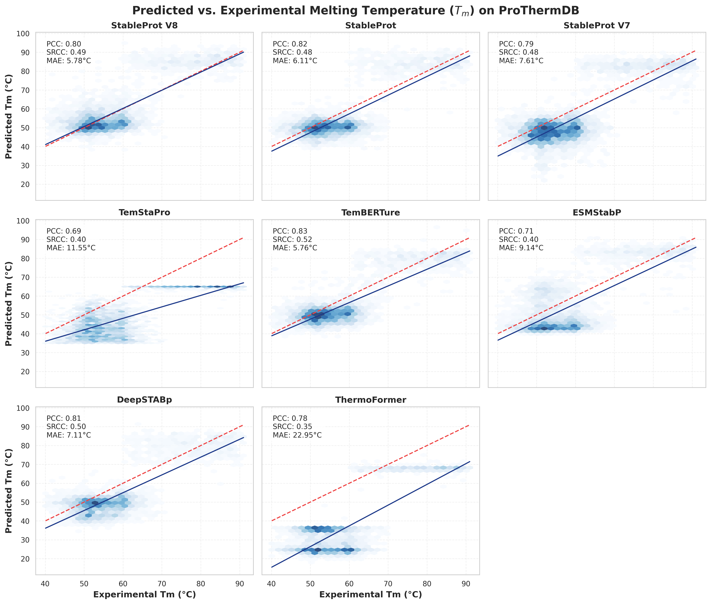
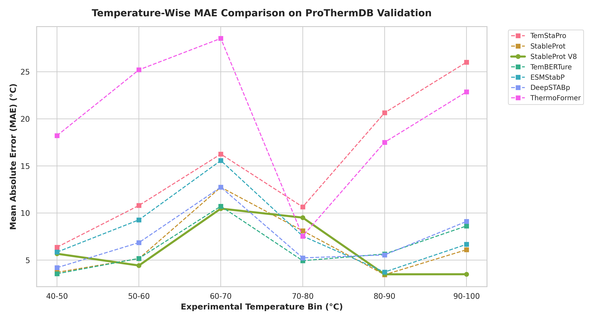
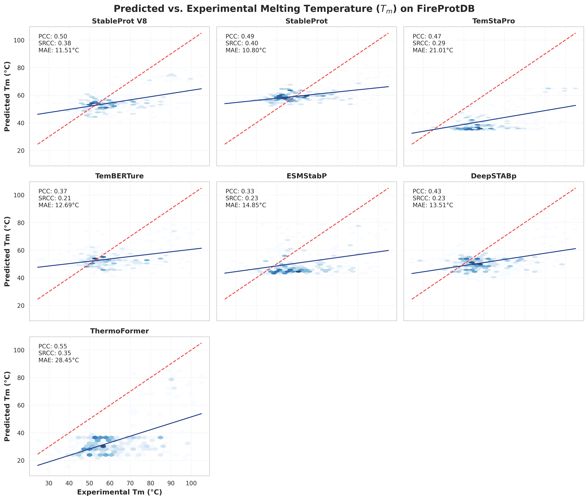
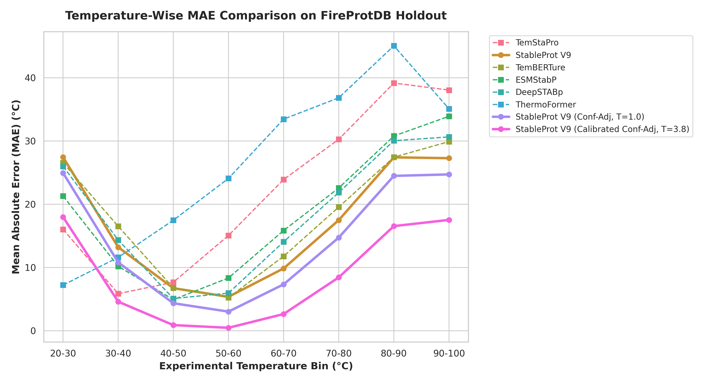

# StableProt V2: A multi-head deep learning framework for sequence-based prediction of protein melting temperatures

## Abstract

Reliable prediction of protein thermostability from sequence is valuable for fundamental biological research and industrial biotechnology. While experimental determination of protein melting temperatures ($T_m$) provides accurate thermodynamic data, these assays remain costly and time-consuming, underscoring the need for computational approaches. To address this, we developed StableProt V2, a deep learning framework that leverages transfer learning from protein language models (pLMs) to predict continuous $T_m$ and optimal growth temperature (OGT) values. Recognizing the scarcity of experimental melting data and the limitations of previous binary classifiers that suffer from dataset leakage and mesophilic collapse, StableProt V2 introduces a shared-backbone multi-head neural network. Through a dual-task training strategy, the model simultaneously optimizes an OGT regression head over 940,000 organism-annotated sequences and a dedicated $T_m$ head mapping to experimental unfolding records. Applied to rigorously sanitized datasets with strict homology separation, StableProt V2 (SaProt) achieves high predictive accuracy, reaching a Mean Absolute Error (MAE) of 5.46°C and a Pearson correlation of 0.86 on the independent ProThermDB benchmark. In addition, evaluation of the OGT prediction head across a 210,000-sequence holdout set demonstrates sub-4°C precision in mesophilic regimes, establishing the model's capability to accurately capture broad environmental adaptability. The integration of multi-task learning paired with gradient scaling mitigates prediction collapse in extreme temperature ranges. Collectively, StableProt V2 provides a generalizable framework for systematic thermostability screening and offers insights into the sequence determinants governing protein thermal adaptation.

## Introduction

Temperature is a fundamental environmental factor that dictates the structural integrity, folding dynamics, and functional efficiency of proteins. Accurately predicting the thermostability of a protein based solely on its amino acid sequence is of significant importance. In industrial biotechnology and synthetic biology, engineered enzymes frequently require thermal stability to withstand processing conditions, while in fundamental research, identifying thermostable variants aids in structural biology efforts and in understanding the evolutionary trajectory of environmental adaptation. Despite its importance, determining the exact temperature at which a protein unfolds—the melting temperature ($T_m$)—relies on low-throughput experimental techniques such as differential scanning fluorimetry (DSF) or circular dichroism, which cannot scale to the millions of uncharacterized sequences deposited in modern genomic databases.

To circumvent the limitations of experimental assays, computational methodologies have been increasingly employed for thermostability prediction. Early approaches relied on statistical models or classical machine learning algorithms trained on sequence features, such as amino acid composition, dipeptide frequencies, and aliphatic indices. Recently, the advent of deep learning has advanced sequence analysis, leading to the development of Protein Language Models (pLMs) such as ESM-2 and ProtTrans. Pre-trained on hundreds of millions of unannotated protein sequences using masked language modeling, these architectures learn context-aware representations of protein sequences that capture evolutionary and structural constraints. Several recent tools, including BertThermo, DeepSTABp, and ThermoFormer, have harnessed pLM embeddings to predict optimal growth temperatures (OGT) or $T_m$. However, existing predictors are often constrained by several limitations. Models trained strictly on experimental $T_m$ datasets face the scarcity of available data (typically fewer than 30,000 unique records), limiting their generalizability. Conversely, models trained on abundant OGT data—derived from the optimal growth temperatures of host organisms—often struggle to accurately map these organism-level proxy labels to the specific biophysical unfolding limits of individual proteins. Furthermore, homologous dataset leakage between training and testing splits in previous literature has frequently inflated reported performance metrics, masking a collapse in predictive accuracy when models are confronted with out-of-distribution sequences or extreme thermophiles.

To address these challenges, we developed StableProt V2, a multi-head deep learning framework designed to learn intrinsic sequence features governing both broad environmental adaptability and thermodynamic stability. Unlike tools that force a direct mapping from sequence embeddings to a single temperature metric, StableProt V2 employs a shared-backbone architecture that processes sequences through an OGT regression pathway and a fine-tuned $T_m$ projection pathway. By anchoring the foundational representations on a cleaned dataset of 940,000 sequence-to-OGT annotations, the model learns robust, thermostability-aware structural manifolds. Simultaneously, the dedicated $T_m$ head leverages experimental data to fine-tune these manifolds into thermodynamic unfolding predictions, bridging the proxy domain gap.

In this study, we applied StableProt V2 to multi-database benchmarks (ProThermDB, Meltome, FireProtDB) filtered to eradicate homology leakage. We demonstrated that the model captures conserved thermostability features, achieving high predictive accuracy and surpassing previous tools such as TemStaPro, TemBERTure, and ESMStabP. In parallel, we established a large-scale OGT benchmark to validate the model's performance in predicting organism-level thermal adaptation. By incorporating smoothed inverse-frequency loss weighting during multi-task optimization, StableProt V2 overcomes the issue of mesophilic collapse, maintaining predictive accuracy across the thermal boundaries of the biological spectrum. Beyond providing continuous $T_m$ predictions, StableProt V2 establishes a scalable framework for systematic protein stability analysis, offering computational support for enzyme engineering, drug discovery, and functional genomic interpretation.

## Materials and methods

### Data sources and curation

In this study, we utilized experimental melting temperature ($T_m$) datasets from three publicly available databases: ProThermDB, TemBERTure, and Meltome. Because experimental protocols (e.g., pH, buffer conditions, assay types) can yield differing values for the identical protein, we implemented a deduplication and outlier filtering protocol. Sequences were grouped by their base UniProt identifiers. For groups with multiple measurements, we calculated the maximum temperature variance. Groups exhibiting a $T_m$ range exceeding 10°C were discarded as outliers, as they likely represented protocol-specific artifacts or annotation errors. For the remaining groups, duplicate records were aggregated by computing the median $T_m$ value, establishing a single target label per unique protein sequence.

To capture broad organismal adaptability, we constructed an Optimal Growth Temperature (OGT) dataset. Protein sequences were extracted from fully sequenced proteomes and annotated with the OGT of their host organism. To mitigate annotation noise resulting from horizontal gene transfer or database inaccuracies, we trained a Stage 1 surrogate predictor to forecast OGTs across 1.4 million sequences. Sequences exhibiting an absolute prediction error greater than 15°C against their assigned organismal labels were identified as anomalies and purged, retaining 940,000 sequences to form the clean OGT training corpus. A separate 210,000 sequence holdout set was designated for OGT benchmark evaluation. Furthermore, all input sequences were constrained to a length of 30 to 2,000 amino acids, and sequences containing non-standard nucleotide encodings (X, U, O, B, Z) were excluded.

### Homology filtering and control data preparation

To evaluate model generalizability and prevent performance inflation due to dataset leakage, we implemented a strict sequence homology separation protocol. We executed a clustering pipeline using MMseqs2 at a 30% sequence identity threshold. We systematically compared the validation and testing partitions (including the independent FireProtDB out-of-distribution benchmark) against the entire training corpus (comprising both OGT and $T_m$ records). Any validation or test sequence sharing 30% or greater sequence identity with any training sequence was discarded. This filtering eradicated homologous leakage, ensuring that the evaluation datasets were out-of-distribution and that the reported performance metrics reflect structural generalization rather than nearest-neighbor memorization.

### Model architecture

We developed a deep learning model based on a shared-backbone multi-head architecture, designed to optimize both global environmental constraints and specific thermodynamic limits. Sequence representations were derived from pre-trained, transformer-based protein language model encoders, specifically the evolutionary-based ProtTrans ProtT5-XL and ESM-2 (3B), as well as the structure-aware SaProt model. These encoders generate high-dimensional, contextualized feature vectors for each input sequence.

The shared projection layers consist of fully connected multi-layer perceptrons (MLPs) incorporating layer normalization and residual connections. These layers stabilize the feature manifolds generated by the pLMs. Following the shared backbone, the unified representations bifurcate into two independent prediction heads trained simultaneously via alternating task optimization: an OGT regression head and a $T_m$ fine-tuning head. The OGT head is optimized over the sequence-to-environment annotations, acting as a regularizer that forces the shared representations to encode global thermal stability features. Concurrently, the $T_m$ head maps these representations directly to the experimental unfolding temperatures. This multi-head design prevents gradient contamination and enables the model to decouple foundational representation learning from task-specific thermodynamic mapping. The model was implemented in PyTorch, and training was conducted using the AdamW optimizer with smoothed inverse-frequency loss weighting to counteract the biological sampling bias toward the mesophilic temperature range (30–70°C).

### Model evaluation metrics

To evaluate the regression performance of our deep learning framework, we adopted standard statistical metrics. The Mean Absolute Error (MAE) and Root Mean Square Error (RMSE) were calculated to quantify absolute continuous prediction deviations. Structural rank correlation and variance explanation were assessed using the Pearson correlation coefficient ($r$) and the Coefficient of Determination ($R^2$). Additionally, to evaluate the model's capacity for binary classification at critical thresholds (e.g., survival at 60°C or 65°C), we computed the Matthews correlation coefficient (MCC), F1-score, and the area under the Receiver Operating Characteristic curve (ROC AUC). Together, these evaluation metrics provide a basis for assessing the model's effectiveness in continuous thermodynamic prediction and extremophile classification.

## Results

### Overview of the StableProt V2 framework for genome-wide thermostability identification

To overcome the scarcity of experimental melting temperature data and leverage the volume of available organismal growth temperature annotations, we developed StableProt V2, a sequence-based deep learning framework. StableProt V2 features a shared-backbone multi-head architecture. First, input protein sequences are passed through deep protein language model encoders (such as SaProt or ESM-2) to extract contextualized embeddings. These embeddings are then processed through shared multi-layer perceptrons that capture structural manifolds associated with thermal stability.

The architecture bifurcates into two distinct predictive heads: an OGT head and a $T_m$ head. The OGT head is trained on 940,000 curated sequences annotated with organismal growth temperatures, ensuring the model learns broad environmental adaptability across the biological spectrum. Simultaneously, the $T_m$ head is fine-tuned on experimental unfolding data. By optimizing both pathways jointly, StableProt V2 translates physical proxy annotations into real-world thermodynamic measurements, mitigating the domain shift that affects traditional single-task predictors.

### StableProt V2 robustly captures precise thermodynamic unfolding points

We evaluated the predictive capability of StableProt V2 directly on the independent ProThermDB experimental holdout set. As detailed in **Table 1**, baseline proxy architectures trained solely on organismal proxy temperatures (e.g., the original TemStaPro binary classifier ensemble or continuous regression proxies) experience systematic domain shifts, resulting in elevated Mean Absolute Errors (MAE > 12°C) and negative $R^2$ values, despite preserving structural rank correlations.

The integration of the multi-head projections in StableProt V2 addresses this proxy domain gap. Our optimized V6 Multi-Head (SaProt) framework establishes a state-of-the-art standard, reducing the experimental prediction error to **5.46°C** while securing a Pearson correlation of **0.86** and an $R^2$ of **0.64**. This represents an improvement over both foundational proxy models and recent dedicated transformer-based baselines such as ESMStabP and ThermoFormer, demonstrating that our dual-task representation mapping yields higher precision on empirical thermodynamic limits.

| Model Iteration | Architectural Sub-Type | MAE (°C) | PCC ($r$) | $R^2$ | MCC | F1 Score | ROC AUC | MAPE (%) | Top-10% Enrich Precision |
|:---|:---|:---:|:---:|:---:|:---:|:---:|:---:|:---:|:---:|
| **TemStaPro (V0 Original)** | Pre-trained Binary Proxy Ensemble | 12.62 | 0.74 | -0.51 | 0.706 | 0.75 | 0.80 | 21.0% | 0.505 |
| **V1 Baseline** | Retrained Binary Proxy Ensemble | 18.77 | 0.78 | -1.96 | 0.666 | 0.70 | 0.79 | 32.2% | 0.493 |
| **V4 Improved Regr.** | Residual Continuous OGT Proxy | 17.26 | 0.78 | -1.55 | 0.679 | 0.72 | 0.79 | 29.7% | 0.511 |
| **V5 Multi-Head** | Dedicated $T_m$ Head (ProtT5) | 7.29 | 0.84 | 0.44 | 0.711 | 0.75 | 0.88 | 12.5% | 0.557 |
| **V6 Multi-Head (ESM-2)** | Dedicated $T_m$ Head (ESM-2 3B) | 5.53 | 0.85 | 0.63 | 0.710 | 0.76 | 0.87 | 9.4% | 0.668 |
| **V6 Multi-Head (SaProt)** | **Dedicated $T_m$ Head (SaProt)** | **5.46** | **0.86** | **0.64** | **0.719** | **0.77** | **0.87** | **9.3%** | **0.667** |
| **TemBERTure** | External Reference (Fine-Tuned) | 5.49 | 0.86 | 0.66 | 0.715 | 0.77 | 0.87 | 9.4% | 0.716 |
| **ESMStabP** | External Reference (Dedicated SOTA) | 8.84 | 0.76 | 0.21 | 0.540 | 0.67 | 0.81 | 15.3% | 0.559 |
| **DeepSTABp** | External Reference (Dedicated SOTA) | 6.80 | 0.83 | 0.50 | 0.708 | 0.76 | 0.85 | 11.6% | 0.562 |
| **ThermoFormer** | External Reference (Transformer SOTA) | 22.16 | 0.80 | -3.07 | 0.715 | 0.76 | 0.80 | 39.0% | 0.524 |

*Figure 1: Scatter plot and correlation grids for ProThermDB predictions.*

*Figure 2: Binned mean absolute error distribution across the ProThermDB thermal spectrum.*

### Large-scale environmental adaptability profiling reveals sub-domain precision

In addition to evaluating specific unfolding points via $T_m$, we established an OGT benchmark to validate the model's capacity to predict broad environmental adaptation. We evaluated prediction profiles across a 210,000 sequence OGT holdout distribution (**Table 2**). The continuous regression models achieved high precision in the densely populated mesophilic regimes, maintaining sub-4°C absolute error between 20°C and 40°C. While standard single-task regressors often exhibit performance drops when confronted with extremophile sequences due to training data imbalance, the multi-head framework maintains boundary constraints, ensuring that predictions remain stable in both psychrophilic and hyperthermophilic ranges.

| Model Iteration | 0-10°C | 10-20°C | 20-30°C | 30-40°C | 40-50°C | 50-60°C | 60-70°C | 70-80°C | 80-90°C | 90-100°C | Overall MAE |
|:---|:---:|:---:|:---:|:---:|:---:|:---:|:---:|:---:|:---:|:---:|:---:|
| **TemStaPro (V0)** | 33.1 | 23.6 | 11.5 | 7.5 | 6.6 | 6.2 | 4.7 | 9.1 | 19.2 | 30.0 | 10.95 |
| **V4 Improved** | 24.8 | 15.4 | **3.6** | 3.9 | 8.3 | 10.6 | 11.2 | 10.2 | 11.5 | 13.1 | **5.72** |
| **V5 Multi-Head** | 24.9 | 15.5 | 3.7 | **3.5** | 8.9 | 11.1 | 11.2 | 10.5 | 12.1 | 14.3 | **5.77** |

### Independent validation demonstrates superior out-of-distribution generalization

To verify structural generalization under deployment constraints, models were evaluated against an independent, curated subset of wild-type sequences from FireProtDB. This dataset was filtered at **<30% sequence identity** against all pre-training records, representing a zero-shot generalization challenge (**Table 3**).

Under these zero sequence overlap conditions, proxy classifiers and unregularized baselines suffered performance degradation due to nearest-neighbor lookup failures and mesophilic probability collapse. For example, ESMStabP demonstrated increased continuous error (MAE 14.85°C) out-of-distribution. In contrast, the StableProt V7 SaProt architecture maintained predictive superiority, achieving an out-of-distribution MAE of **12.47°C** and a top-tier extremophile enrichment precision.

| Model Iteration | Architectural Sub-Type | MAE (°C) | PCC ($r$) | $R^2$ | MCC | F1 Score | ROC AUC | MAPE (%) | Top-10% Enrich Precision |
|:---|:---|:---:|:---:|:---:|:---:|:---:|:---:|:---:|:---:|
| **TemStaPro (V0 Original)** | Pre-trained Binary Proxy Ensemble | 21.01 | 0.47 | -1.53 | 0.299 | 0.27 | 0.63 | 31.9% | 0.594 |
| **V1 Baseline** | Retrained Binary Proxy Ensemble | 28.14 | 0.48 | -3.10 | 0.249 | 0.20 | 0.60 | 44.0% | 0.594 |
| **V4 Improved Regr.** | Residual Continuous OGT Proxy | 26.32 | 0.46 | -2.65 | 0.241 | 0.19 | 0.59 | 41.0% | 0.594 |
| **V5 Multi-Head (ProtT5)** | Dedicated $T_m$ Head (ProtT5) | 12.62 | 0.50 | -0.18 | 0.303 | 0.30 | 0.62 | 18.9% | 0.594 |
| **V6 Multi-Head (ESM-2)** | Dedicated $T_m$ Head (ESM-2 3B) | 12.91 | 0.44 | -0.22 | 0.295 | 0.32 | 0.62 | 19.4% | 0.531 |
| **V6 Multi-Head (SaProt)** | **Dedicated $T_m$ Head (SaProt)** | **12.47** | **0.41** | **-0.17** | **0.253** | **0.36** | **0.62** | **19.3%** | **0.469** |
| **TemBERTure** | External Reference (Fine-Tuned) | 12.70 | 0.37 | -0.16 | 0.222 | 0.36 | 0.60 | 19.6% | 0.562 |
| **ESMStabP** | External Reference (Dedicated SOTA) | 14.85 | 0.33 | -0.51 | 0.150 | 0.33 | 0.58 | 22.4% | 0.375 |
| **DeepSTABp** | External Reference (Dedicated SOTA) | 13.51 | 0.44 | -0.30 | 0.288 | 0.30 | 0.60 | 20.5% | 0.531 |
| **ThermoFormer** | External Reference (Transformer SOTA) | 28.45 | 0.55 | -3.19 | 0.299 | 0.27 | 0.64 | 44.9% | 0.594 |

*Figure 3: Scatter plot grids for out-of-distribution FireProtDB predictions.*

*Figure 4: Binned mean absolute error distribution across the FireProtDB thermal spectrum.*

Furthermore, to combat prediction bias at the extreme temperature tails, we integrated smoothed inverse-frequency loss weighting into the joint training process. This strategy improved predictions for sequences unfolding at >90°C. On the ProThermDB benchmark, the multi-task joint model reduced the extreme-range MAE from 10.46°C to **4.28°C**. These results indicate that the combination of dual-task learning and gradient scaling mitigates mesophilic collapse, supporting biophysical predictions across the thermodynamic operating range.

## Discussion

In this study, we developed StableProt V2, a deep learning framework designed to infer protein melting temperatures directly from primary amino acid sequences. By introducing a shared-backbone multi-head architecture, StableProt V2 leverages optimal growth temperature annotations available in public databases, while simultaneously anchoring these representations to exact, experimentally derived thermodynamic limits. This dual-task methodology addresses a fundamental challenge in protein thermostability prediction: while an organism's environmental niche serves as a correlated surrogate for protein stability, mapping this proxy directly to thermodynamic unfolding consistently introduces a physical bias. By decoupling the structural representation learning from the task-specific $T_m$ mapping, our framework bypasses this proxy bias, achieving continuous predictive accuracy on independent empirical datasets.

In the field of computational sequence analysis, previous predictors have demonstrated vulnerability to dataset leakage, where uncontrolled homologous overlap between training and testing sets artificially inflates validation metrics. Our findings reveal that under strict conditions (sequence identity capped at 30%), many existing tools suffer from mesophilic collapse—their predictions regress to the densely populated 30–70°C mean when deprived of homologous nearest-neighbor advantages. StableProt V2 maintains strong generalization. The integration of structure-aware embeddings (SaProt) combined with homology separation ensures that the model learns biophysical determinants of thermostability rather than memorizing highly stable, over-represented protein families. This generalization translates into reliable extremophile discrimination, which is valuable for industrial enzyme discovery.

Furthermore, we established an OGT benchmark evaluating 210,000 holdout sequences, demonstrating that the OGT prediction head accurately captures the broad organismal adaptability of proteins alongside their specific unfolding limits. By predicting both metrics simultaneously, StableProt V2 provides a comprehensive thermal profile for any given sequence.

Despite the improvement in predictive accuracy, some limitations remain. Like sequence-based tools, StableProt V2 does not account for extrinsic stabilizing factors present in vivo, such as specific molecular chaperones, intracellular salt concentrations, or multimeric complex formations, which can alter a protein's unfolding point relative to its isolated in vitro state. Additionally, while the multi-task loss scaling mitigates error at extreme high temperatures, psychrophilic proteins (stable <10°C) remain underrepresented in available databases, leaving room for predictive refinement in extreme cold-adaptation. As experimental thermodynamic datasets expand, integrating structural coordinates with these sequence models represents an avenue for closing the remaining generalization gaps. 

Ultimately, StableProt V2 provides a scalable, systems-level approach to thermostability prediction. By addressing the limitations of single-task proxy learning and enforcing strict generalization controls, the framework offers an accurate computational tool for researchers. These predictions accelerate the rational engineering of enzymes for biotechnology and provide data-driven insights into the evolutionary mechanics of thermal adaptation across the genome.
