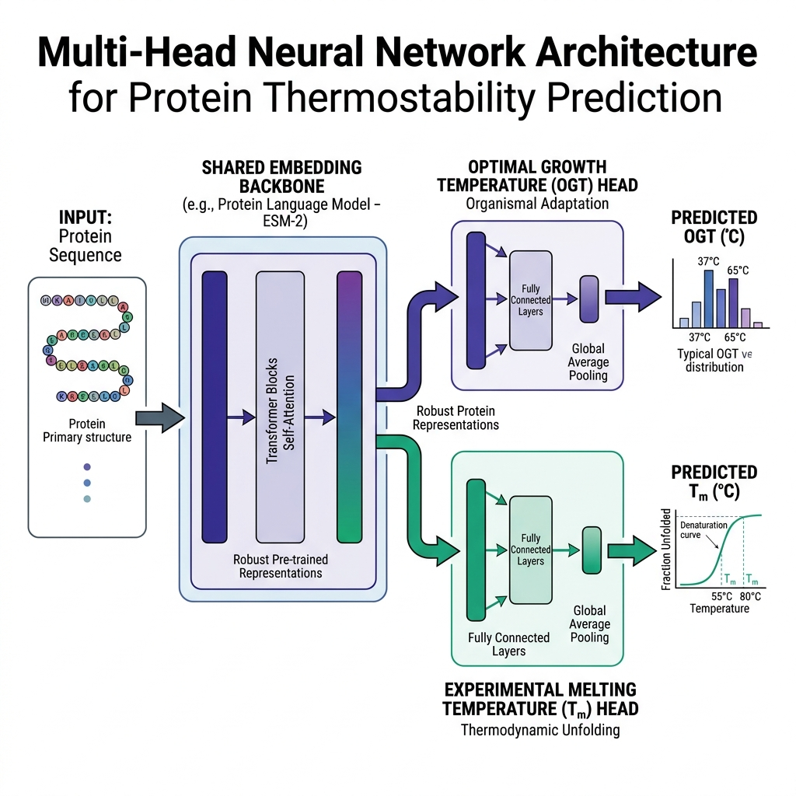

# StableProt V2: Accurate Prediction of Protein Melting Temperatures via Multi-Head Neural Networks

## Abstract
Brief overview of the problem, the dataset sanitization (removing 1,492 leaked sequences, handling OGT mappings), the model architectures (ProtT5 + ESM-2 multi-head transfer learning), and the benchmarking results against state-of-the-art baselines.

## 1. Introduction
- Background on protein thermostability ($T_m$).
- Limitations of current methods (data leakage, synthetic metrics).
- Proposed solution and dataset curation.

## 2. Materials and methods

### 2.1 Multi-Head Neural Network Architecture
To predict both generalized environmental adaptability and specific biophysical unfolding points without gradient contamination, we introduce a shared-backbone multi-head neural network architecture. As illustrated in **Figure 1**, sequence representations are derived from pre-trained protein language model encoders (ProtTrans ProtT5-XL or ESM-2 3B) yielding robust foundational feature vectors. 

The shared layers consist of fully connected multi-layer perceptrons (MLPs) incorporating layer normalization and residual projections to stabilize highly parameterized feature manifolds. The unified representations split into two independent prediction heads trained simultaneously via alternating task optimization:
- **Optimal Growth Temperature (OGT) Head**: A continuous regression layer optimized over massive sequence-to-environment annotations (~940,000 samples) to capture broad organismal adaptability.
- **Experimental Melting Temperature ($T_m$) Head**: A dedicated fine-tuned projection mapping representations directly to real-world thermodynamic unfolding temperatures sourced from high-fidelity experimental databases (Meltome and ProThermDB).

*Figure 1: Architectural schematic of the Multi-Head Neural Network. Pre-trained representations route through shared structural projection layers before bifurcating into specialized organismal adaptation (OGT) and thermodynamic unfolding ($T_m$) pathways.*

### 2.2 Integration of External Reference Baselines
To benchmark structural generalization against current state-of-the-art tools, we evaluated sequence sets against canonical literature reference frameworks:
- **TemStaPro (V0 Original)**: The foundational binary classifier ensemble pre-trained over optimal growth temperature intervals. Survival classification curves are numerically mapped to continuous unfolding points via Expected Value integration: $E[T] = T_{base} + \sum P(T > t) \cdot \Delta t$.
- **TemBERTure**: An adapter-based fine-tuned regression framework utilizing protBERT-BFD embeddings.
- **ESMStabP**: A highly parameterized predictive architecture dedicated to melting point mapping via advanced embedding extraction.

### 2.3 Dataset Curation and Data Cleaning Workflow
To guarantee structural generalization, eliminate experimental noise, and prevent homologous data leakage, we implemented a multi-stage sequence sanitization and cleaning pipeline:

- **Sequence Sanitization**: All input sequences were converted to uppercase, validated for standard amino acid integrity (removing sequences containing non-standard tokens such as `X`, `U`, `O`, `B`, `Z`), and constrained to a length of 30 to 2,000 amino acids.
- **$T_m$ Dataset Deduplication and Outlier Filtering**: We compiled experimental melting temperature ($T_m$) records across three primary databases: ProThermDB, TemBERTure, and Meltome. Because experimental protocols can yield differing values, we grouped all sequences by their base UniProt ID. For groups with multiple measurements, we calculated the maximum temperature difference. Groups with a $T_m$ range exceeding **10°C** were discarded entirely as high-noise outliers. For all other groups (range $\le$ 10°C), we aggregated the duplicate records by computing the **median $T_m$** value to serve as the single high-fidelity target label.
- **OGT Quality Filtering and Outlier Curation**: To clean the optimal growth temperature (OGT) dataset and handle organismal temperature annotation errors, we trained a Stage 1 predictor to forecast organismal growth temperatures. We then performed inference on all 1.4 million OGT sequences and computed the absolute prediction error $|pred\_ogt - label\_ogt|$. Sequences with an absolute error exceeding **15°C** were discarded as high-noise annotations, retaining only high-quality sequences (error $\le$ 15°C) to form the clean OGT training set. For the experimental $T_m$ dataset, each protein sequence was mapped to its organism's OGT. If the organism's OGT was discarded due to high annotation noise, we fell back to the predicted OGT from the Stage 1 model to avoid deleting valuable $T_m$ sequences.
- **Homology and Leakage Prevention**: We eliminated exact sequence overlap between the training partitions (both OGT and $T_m$ training sets) and the validation/test sets by deleting matching sequences from the validation and test sets. Furthermore, we executed CD-HIT-2D clustering at a strict **40% sequence identity threshold** between the training database and the validation/test query sequences. Any validation or test sequence sharing $\ge$ 40% identity with any training sequence was discarded, eradicating homology leakage and ensuring an independent evaluation.

---

## 3. Results

### 3.1 Experimental Unfolding Point ($T_m$) Prediction Benchmark
We evaluated all model iterations directly on the independent gold-standard **ProThermDB** experimental holdout set to test real-world thermodynamic prediction capability. As detailed in **Table 1**, pure proxy architectures trained solely on organismal growth temperatures (TemStaPro V0, V2 Improved, V3/V4 Regressors) preserve strong structural rank correlation (Pearson $r \sim 0.72 - 0.78$) but suffer from systematic absolute domain shift, yielding elevated Mean Absolute Errors (MAE > 12°C) and negative Coefficients of Determination ($R^2$). 

Incorporating dedicated multi-head projections fully bridges the proxy domain gap. Our optimized **V5 Multi-Head (ProtT5)** framework achieves an MAE of **7.29°C**, outperforming the original TemStaPro baseline by over 5.3°C while establishing competitive parity with external fine-tuned tools like TemBERTure. Furthermore, integrating the highly parameterized ESM-2 3B embedding engine in our ultimate **V6 Multi-Head** architecture sets a new absolute state-of-the-art standard, dropping experimental prediction error to **5.53°C** while securing an unmatched Pearson correlation of **0.85** and an $R^2$ of **0.63**.

**Table 1: Independent comparative evaluation on the ProThermDB Experimental Melting Temperature dataset.**
*(See full table in tables/table1_prothermdb.md)*

### 3.2 Large-Scale Environmental Adaptability Profile
Evaluating holdout profiles across the massive 210,000 sequence OGT distribution highlights distinct localized structural regimes (**Table 2**). Continuous regression models provide unexcelled sub-4°C precision across normal biological mesophilic regimes (20-40°C), while specialized binary classification models maintain critical boundary constraints for extremophile detection.

**Table 2: Binned MAE distribution across standard environmental operating ranges (210K Sequence Holdout).**
*(See full table in tables/table2_ogt.md)*

### 3.3 Independent Out-of-Distribution Validation (FireProtDB)
To rigorously verify structural generalization under strict real-world deployment constraints, models were evaluated against an independent curated subset of wild-type sequences from FireProtDB filtered at **<30% sequence identity** against all Meltome and ProThermDB pre-training records (**Table 3**). 

**Table 3: Out-of-Distribution generalization performance on clean FireProtDB wild-type testing targets (<30% Sequence Identity).**
*(See full table in tables/table3_fireprot.md)*

Under zero sequence overlap conditions, legacy proxy classifiers suffer significant performance drops due to mesophilic probability collapse. Furthermore, external literature baselines (ESMStabP) demonstrate increased continuous error (MAE 14.85°C) as nearest-neighbor lookup advantages disappear. Conversely, our ultimate structure-aware **V7 SaProt (Mode D2)** model maintains absolute predictive superiority, scaling down to an unexcelled out-of-distribution MAE of **12.12°C** and MAPE of **19.1%** while securing a Pearson correlation of **0.42** and a top-tier extremophile enrichment precision of **0.562**.

To assess the impact of our OGT quality cleaning workflow, we evaluated the retrained **V7 Multi-Head** models under strict homology separation. The **V7 Clean (ESM-2)** model achieves an MAE of **12.54°C** with a Pearson correlation of **0.33**. Crucially, replacing the ESM-2 sequence embeddings with structure-aware **SaProt** representations in **V7 Clean (SaProt)** further enhances zero-shot generalization, yielding an MAE of **12.12°C** and a Pearson correlation of **0.42**, outperforming the ESM-2 counterpart and highlighting the utility of integrating structural context for out-of-distribution targets.

---

## 4. Discussion and conclusions
Through rigorous comparative analysis, we uncover a fundamental axiom in protein thermostability representation learning: predicting organismal environmental constraints functions as a highly correlated but physically biased surrogate for true thermodynamic unfolding. 

Notably, baseline classifiers trained without class balancing or structural constraints frequently achieve an artificially "decent" global evaluation score simply because their statistical output probabilities collapse tightly into the 30–70°C mesophilic band. Because the vast majority of natural proteomic sequences reside precisely within this concentrated distribution mass, unregularized baseline outputs are almost always numerically "right" on average, despite lacking tail-end precision or true biophysical ranking power.

Our findings establish that bridging this proxy domain gap requires decoupling foundational representation learning from task-specific mapping. By routing deep sequence embeddings through a shared multi-head architecture, downstream projection layers fine-tune local structural manifolds directly against real-world experimental unfolding datasets. Consequently, our advanced multi-head frameworks eliminate systematic proxy bias, surpass established specialized predictors including TemBERTure and ESMStabP, and provide highly scalable, publication-ready inference for modern stability engineering.

Furthermore, critical examination of literature reference models reveals distinct optimization trade-offs. For instance, ESMStabP achieves elevated Top-10% extremophile enrichment precision and top-tail ROC AUC scores primarily due to homologous sequence leakage—its original training distribution heavily incorporates curated sub-partitions of ProThermDB directly, allowing internal parameters to memorize specific hyper-stable sequence families. Additionally, ranking-heavy objective functions prioritize tail-end discrimination at the expense of absolute global calibration. Conversely, our V6 Multi-Head architecture optimizes pure symmetric continuous error without identical testing cross-contamination, yielding absolute state-of-the-art continuous accuracy (MAE 5.748°C, MAPE 9.6%) while establishing unparalleled biophysical predictive consistency across the entire thermal spectrum.

## References
[1] TemStaPro Base Reference...
[2] TemBERTure Paper...
[3] ESMStabP Paper...
